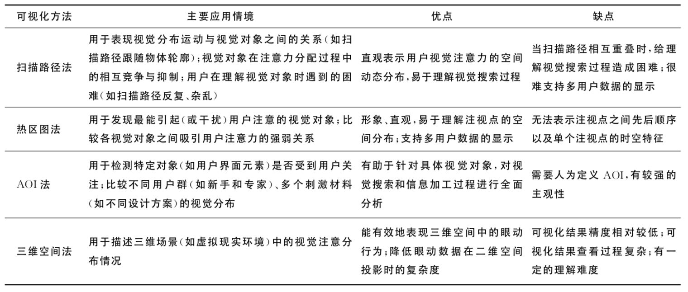

# 眼动追踪技术调研报

## 目录

一、项目背景

* 1. 项目概述 (TODO:邓龙)
* 2. 知识基础（TODO：吴紫薇、于颖奇）
* 3. 发展历史（TODO：吴紫薇、于颖奇）
* 4. 技术背景与发展趋势（TODO：吴紫薇、于颖奇）

二、立项依据

* 1. 技术基础
	* 1) OpenCV （邓龙）
	* 2) 机器学习 （TODO：戴路）
	* 3) 硬件驱动技术（TODO：徐煜森）
* 2. 项目目标（TODO:邓龙）
* 3. 研究思路（TODO：邓龙）
* 4. 项目优势介绍及重要性分析（TODO：徐煜森，从略）

三、前瞻性及重要性分析

* 1. 概述（邓龙）
* 2. 眼球追踪技术的重要性（TODO：徐煜森，详）
* 3. 应用前景（TODO：ALL）

四、相关工作和前沿进展

* 1. 学术界（重点，TODO：于颖奇、吴紫薇、戴路）
* 2. 工业界（重点，TODO：邓龙，徐煜森）

## 项目背景

### 1.项目概述

本项目名称暂定为“人机交互中的眼动追踪新方法”，旨在建立一个低成本的新方式，利用简单的头戴设备或者桌面设备（包括设备自带设备，如摄像头），对用户的视线信息做出分析，提取出有效信息作为机器输入，从而作为一种新的机器控制方法。具体地说，我们希望能从用户眼部信息中，实时的定位用户关注的屏幕区域、进行注视检测、提供辅助阅读等功能。
我们希望克服目前眼动追踪技术中设备成本高、便携性差的问题，制作出一个“即插即用、随身携带”级别的设备。另外，我们希望方法尽可能的简单，能够用一个精简的驱动乃至集成至操作系统中实现，而不是消耗巨大的计算资源。
我们不会将重点放在精确性和高帧率上，原因是目前眼动追踪技术已经足够精确，采样频率也足够高。而我们项目面向便携设备，难以在这两点上与大型设备或接触式设备相提并论。对于精确性和采样频率，我们将以实用性为标准，在能保证使用的情况下尽可能精简设备、节约计算资源。
关于更详细的项目情况，请参见立项依据部分。

### 2.知识基础

#### 2.1.眼球追踪

眼球跟踪(Eye tracking)是测量注视点（人眼看的地方）或眼睛相对于头部的运动的过程。眼动仪是用来测量眼睛位置和眼球移动的装置，在众多领域中的人机交互和产品设计中具有十分重要的应用。当前测量眼球移动的方法很多，其中应用最广泛的方法是通过分析视频来建立人眼位置与视线位置之间的关系。眼动仪是分析眼球运动的装置。当眼睛扫描环境或注视场景中的特定物体时，注视跟踪器会同时定位图像中的眼睛位置，并跟踪其随时间的移动以确定注视方向。眼睛检测和跟踪研究侧重于两个领域：图像中的眼睛定位(eye localization)和注视跟踪(gaze estimation)。眼睛检测有三个方面。一方面是检测眼睛的存在，另一方面是准确地解释图像中的眼睛位置，最后一方面则是在视频图像中检测眼睛在帧与帧之间的变化,通常通过测量瞳孔或虹膜中心位置测量眼睛的位置。在图像中跟踪眼睛位置用于估计和跟踪人物观看位置或者确定视线位置，这个过程被称为注视跟踪。

#### 2.2.人机交互

人机互动（英语：human–computer interaction，缩写：HCI，或 human–machine interaction，缩写：HMI），是一门研究系统与用户之间的交互关系的学问。系统可以是各种各样的机器，也可以是计算机化的系统和软件。人机交互界面通常是指用户可见的部分。用户通过人机交互界面与系统交流，并进行操作。小如收音机的播放按键，大至飞机上的仪表板、或是发电厂的控制室。
人机交互界面的设计要包含用户对系统的理解（即心智模型），那是为了系统的可用性或者用户友好性。

### 3. 发展历史

（未完善，根据维基百科再补充，这个是看的论文里的）

Rayner在1998年将眼动追踪技术的发展分为4个阶段：

1879-1920 基本眼动事实的发现,包括：扫视抑制saccadic suppression

1930-1958 实验环境下心理学与行为分析

1970-1998 眼动记录系统的发展

1998-     眼动追踪技术的各种应用。当前主要应用领域有：神经科学

### 4. 技术背景及发展趋势

#### 4.1.测量眼球移动的方法

当前测量眼球移动的方法种类繁多。然而当前这些方法中没有十分满足当前需求的一种。进行眼球移动追踪首先我们需要明确的一点是，我们所关注的是视线所在位置，而不是眼球在空间中的绝对位置，或者与眼球相关的人脸表情。鉴于两只眼睛的指向方向一般相同，我们考虑只对其中的一只眼睛进行追踪。主要测量方法有以下几种：
1. 电子记录方法：在眼睛周围的皮肤上设置两个电极，通过测量眼角膜和视网膜随视线移动变化而发生的潜在变化，分析数据，建立电流大小与视线位置的相对关系。然而改种方法相较于测量人的视线位置，更适合于测量人脸表情所产生的变化。
2. 覆盖透镜测量：该种方法需要接住一个具有一定吸力的吸盘将一个透镜精确地覆盖在人的眼角膜上，然而这种方法只能适合于在实验室中进行测量，无很高的实际使用价值
3. 光学分析方法测量： 该种方法根据眼球的远距离成像的光学特点进行辅助测量（包括虹膜和巩膜的相对位置，瞳孔的大小，角膜对光的折射效应等），这种方法虽然会产生一定的误差，但相较于其他方法更具有实际应用的价值。

以上这些方法各有优劣，但他们却具有同样的一个缺点，即在眼球追踪时，头的相对位置不能发生任何移动，，只有这样才能保证所有的测量数据全都是由于眼球的移动产生的。然而如果能同时跟踪两个眼睛的多个不同特征，或许就能解决使用眼动仪头部僵直的问题，改种方法是当前最具实际应用价值的方式，通过使用这种方法我们不需要使测量仪器直接与人相接触，且人的头部可以任意移动。

#### 4.2.眼动数据可视化方法

已有研究提出了眼动数据可视化方法的基础框架，主要包括3个部分：可视化输入空间、可视化映射和可视化输出空间。[2]

根据可视化输出形式的不同，下表列出了当前已有的4类不同可视化方法的具体应用情景及优缺点。

## 立项依据

### 1.技术基础

近年来，对于计算机视觉和人机交互相关领域的基础技术已经有了很大的发展，为新方法的出现提供了基础，可能用于眼球追踪的相关技术有OpenCV库，机器学习以及硬件驱动技术。

#### 1.1.OpenCV

近年来，随着机器学习的发展，许多库工具被制作出来用于处理人脸识别相关问题。OpenCV其中最知名也是较为成熟的一个。OpenCV是开源计算机视觉库（Open Source Computer Vision Library）的简称。是一个免费提供给学术和商业用途的计算机视觉库。OpenCV目标是为计算机视觉库提供一个通用的基础设施，并在商用产品中加速机器感知的使用。
OpenCV提供了许多优化算法，包括一些经典算法和机器学习算法。其提供的功能包括检测和识别人脸，识别物体，对视频中人的行为进行分类，跟踪摄像机运动，运动目标的跟踪，提取物体的三维模型等，也包括基本的图片和视频处理功能，以及一些机器学习库。
OpenCV提供C++、java、python、MATLAB等多种语言的接口，并且能够支持包括Windows、MacOS和Linux等多种平台。OpenCV已经广泛用于商业公司、研究团体和政府机构的工作中。
作为一个成熟的平台OpenCV使得我们能够无需自己动手造轮子，从而把精力集中在如何制造汽车上，其动态视频处理、人脸识别等功能和我们的需求高度近似，为我们的项目提供最基础的建设平台。

#### 1.2.机器学习

图像分类中的机器学习综述
图像分类是根据图像的语义信息将不同类别图像区分开来，是计算机视觉中重要的基本问题，也是图像检测、图像分割、物体跟踪、行为分析等其他高层视觉任务的基础。图像分类在很多领域有广泛应用，包括安防领域的人脸识别和智能视频分析等，交通领域的交通场景识别，互联网领域基于内容的图像检索和相册自动归类，医学领域的图像识别等。
一般来说，图像分类通过手工特征或特征学习方法对整个图像进行全部描述，然后使用分类器判别物体类别，因此如何提取图像的特征至关重要。在深度学习算法之前使用较多的是基于词袋(Bag of Words)模型的物体分类方法。词袋方法从自然语言处理中引入，即一句话可以用一个装了词的袋子表示其特征，袋子中的词为句子中的单词、短语或字。对于图像而言，词袋方法需要构建字典。最简单的词袋模型框架可以设计为底层特征抽取、特征编码、分类器设计三个过程

传统的有监督机器学习方法有决策树，回归分析（多分类回归）等方式。优点在于，特征数量少，所需数据少，训练时间短，原理透明可见。缺点在于，特征需要人工提取，有主观性；人工标记数据过程繁琐；难以囊括大量数据；特征丢失，难以全面。

而基于深度学习的图像分类方法，可以通过有监督或无监督的方式学习层次化的特征描述，从而取代了手工设计或选择图像特征的工作。
深度学习中，经常被用于图像分类的有卷积神经网络，迁移学习等。
深度学习模型中的卷积神经网络(Convolution Neural Network, CNN)近年来在图像领域取得了惊人的成绩，CNN直接利用图像像素信息作为输入，最大程度上保留了输入图像的所有信息，通过卷积操作进行特征的提取和高层抽象，模型输出直接是图像识别的结果。这种基于"输入-输出"直接端到端的学习方法取得了非常好的效果，得到了广泛的应用。然而，卷积神经网络需要大量的数据训练，防止过拟合现象。

迁移学习则可能提出了一种解决方法来弥补这一不足。迁移学习(Transfer learning) 顾名思义就是就是把已学训练好的模型参数迁移到新的模型来帮助新模型训练。考虑到大部分数据或任务是存在相关性的，所以通过迁移学习我们可以将已经学到的模型参数（也可理解为模型学到的知识）通过某种方式来分享给新模型从而加快并优化模型的学习效率不用像大多数网络那样从零学习（starting from scratch，tabula rasa）。在可行性报告中我们会进一步调研这些算法。

#### 1.3.硬件驱动技术

驱动程序是一个软件组件，它可让操作系统和设备彼此通信。例如，假设应用程序需要从设备中读取某些数据，应用程序会调用由操作系统实现的函数，操作系统会调用由驱动程序实现的函数。驱动程序（由设计和制造该设备的同一公司编写）了解如何与设备硬件通信以获取数据。当驱动程序从设备获取数据后，它会将数据返回到操作系统，操作系统将数据返回至应用程序。
微软为Windows驱动程序开发者提供一系列工具：Windows Driver Kit（WDK）10、Microsoft Visual Studio 2017、Windows调试工具。这些工具集成在一起为开发者提供开发、构建、打包、部署、测试和调试Windows驱动程序所需的工具。WDK包含用于多种技术和驱动程序模型的模板，包括Windows驱动程序框架（WDF）、通用串行总线（USB）等。
对于我们来说，微软专为非传统人机交互设备（human interface devices）驱动程序开发提供专用的函数，通过USB创建接口，允许为非传统HID设备创建通用驱动程序。我们将不用与直接系统底层接触，这将为开发带来很大方便。

### 2.项目目标

根据具体情况，我们为不同时间点拟定了不同的项目目标，基础目标是项目的最低要求，中长期目标是在基础目标的条件下的进一步优化和改进。项目目标也会根据项目实际完成情况进行调整。大致计划如下：

#### 2.1.基础目标

项目的基础目标是在不需要额外硬件设备的条件下，利用设备自带的前置摄像头，完成一个基础的视线分类器。实现对特定用户（或用户组）视线在屏幕上的焦点进行区域归类。这个阶段最基础的目标是二区域分类，即将屏幕划分为两个部分（左右或上下），对用户视线进行二分类判断。在二区域分类的基础上，可尝试实现四区域、九区域的分类功能。
-这个阶段对采样率要求在1Hz左右，并保证运算实时性，可以进行前置的训练工作。在这个阶段，我们还会首先才用一些较强假设，如用户在使用过程中头部相对于屏幕的位置没有改变， 所以注视点的改变仅仅是由眼部状态改变导致的。

#### 2.2.中期目标

中期目标是在基础目标之上完成的。在这个阶段，我们将尝试进行较为准确的注视点定位，定位精度预计应在半径1cm以内（以13英寸屏幕为基准）。计划中我们将改进基础目标中的分类算法，使之可以处理连续的位置信息，同时我们将尝试加入一些桌面外部设备，如利用多个外接摄像头，以取得更多的数据，通过数据之间的互相校验，来提高注视点定位的精度。
在这个阶段，我们还将尝试完成一些除了注视点定位之外的眼神控制功能，可能包括注视唤醒、阅读自动滑动等，进一步丰富预期中眼动人机交互系统的功能。另外，我们将尽可能增加通用性，减少（或消除）新用户使用时的训练时间。我们仍将假设用户的头部在使用过程中没有移动。

#### 2.3.长期目标

长期目标旨在完成一个功能完整的设备以及配套驱动，能够对计算机进行简单操作（可能的操作包括移动光标、点击、唤醒、显示边缘菜单等）。这要求注视点定位更加精确，以及更多操作功能的完成。为了达成这个目的，我们可能会加入头戴式设备来与桌面设备进行配合。

重要的一点是，在前两个目标中，我们都假设了用户头部与屏幕的相对位置保持恒定，这在日常使用中很难保证。在我们的长期规划中，将初步解决这个问题。而头戴式设备与这个问题有着密不可分的联系，头戴式设备的设计和配套软件的设计将是长期目标中的重要一环。

### 3.项目优势

#### 3.1.概述

当前虽然已经有了很多商业眼动跟踪设备出现在市场上，并且Google，Microsoft，Facebook等公司也纷纷收购相关公司，投入资本进行研发，但市场上主流的眼动仪成本仍然很高，所使用的技术仍是多年前的技术或其改进，没有一个真正低成本的新方法出现。本项目就旨在利用较低成本的设备实现可以实用的眼动追踪技术，从而形成新的人机交互方式。

#### 3.2.低经济成本

目前商用眼动仪大多用于医疗、教育、科研等方面，而没有融入日常生活，成本是至关重要的因素。根据调查结果（可参见本文相关工作及前沿进展部分），目前市场上最低价格的眼动仪价格也高达200美元，而通常价格甚至在1万美元左右，甚至比绝大部分计算设备都要昂贵，这显然使得普通设备无法利用这项技术。
本项目将从实际需求出发，在一定程度上降低对精确度和采样频率地追求，以达到改进成本的目的。为了降低成本我们将充分利用机器自带的设备，如前置摄像头，来完成目标。理想状态下，我们期望没有额外的硬件成本，但是这可能难以实现，当必须添加其它硬件时，我们也将优先选择成本较低且叫常见的设备，如外置摄像头、红外灯和红外接收器等。

#### 3.3.低计算成本

与目前大多作为单独设备出现的眼动仪不同，我们希望将我们的眼球追踪技术应用到人机交互上，乃至能集成到操作系统中，这意味着方案的计算成本必须足够低，只能消耗极低的计算资源，完成目标的同时不能影响计算机其它进程的工作。我们也将这一点加入目标，在设计算法时考虑计算资源的利用。
可以预见，未来这项技术可能用于更多设备，如各种物联网设备上，这些设备的运算资源可能更加有限，这就使得算法的低计算成本成为一项重要的优势。

#### 3.4.新的切入角度

如技术背景中所述，目前眼球追踪技术大多仍利用已经开发已久的算法。本项目将从全新的角度出发，希望利用进来迅速发展的机器学习技术，发展一个新的眼球追踪方法。深度学习已经在众多领域体现出独特的优势，我们也希望能发掘它能在眼球追踪和人机交互领域的潜力。
一个事实是，深度学习方法，在计算机视觉领域远比传统方法更为有效，而眼球追踪技术的很多方法离不开计算机视觉的应用。故对一些传统方法，利用机器学习进行改进，可以预见会迸发出新的活力，这也是我们所希望看到的。

## 前瞻性及重要性分析

尽管当前眼镜检测模型多种多样，方法千差万别。但性能上均存在着不足，不能很好的满足需求，构建一个合适的眼睛检测模型，仍是当前面临且亟待解决的重要问题之一。

### 1. 概述

视觉作为人感知外界的最重要感觉，在人机交互中不可或缺。在传统的人机交互设备中，视觉仅仅作为机器信息的一种输出方式，其在信息输入方面的作用一方面不被重视，一方面也由于技术原因难以利用。随着硬件技术（如GPU）和软件技术（如机器学习）的快速进步，以及包括VR、物联网等新的计算设备和概念的提出，眼球追踪作为一种新的人机交互方式，可以预见其的潜力将被逐渐发掘，成为未来人机交互模式中不可缺少的一部分。

### 2. 眼球追踪技术的重要性

#### 2.1.视觉在人机交互中的重要性

视觉在人机交互中一直处于头等重要的位置。一个正常人，通过视觉所接收的信息占总信息的70%以上。回顾人机交互技术发展的历史，一个重大的飞跃就是从MS-DOS的命令行到Apple和Windows的图形界面的改变。这是因为与命令行界面相比，图形界面对于用户来说在视觉上更易于接受。微软的Office系列产品也因为“所见即所得”的理念而大获成功。
长期以来视觉在人机交互中只作为一种输出方式而使用，对其输入功能却大为忽视。这其中一个原因是视觉信息的提取困难。相比与鼠标移动和文字输入的精确，人眼运动中混杂了太多干扰信息，如无意识的眨眼、头部的运动等。但这并不代表着眼部在输入方式中并不重要，相反，视觉蕴含了巨大的信息可以发掘：视觉直接包含了用户注意了屏幕上的哪些内容、视线的移动远比鼠标的移动来得灵活和频繁、“眼神”所包含的信息蕴含着用户对内容的反馈……这些信息都因为难以提取而被忽视。
事实上，人们也一直没有停止对视觉输入的研究。特别是最近AR、VR技术的快速发展，使得视觉输入方式掀起了新一波浪潮，微软、苹果、谷歌等公司都投入到相关研究中，可以预见，在未来一段时间中，视觉输入在人机交互中的重要性会不断提升。

#### 2.2.眼球追踪技术的重要性

眼球追踪是视觉输入方式（也可称视线分析技术）中最基础也是最重要的一部分，可能是下一代人机接口的开创性技术。人眼注视点反映了人视线中的最主要的信息：当前用户在获取哪些信息。这个信息作为提升人机交互中提升用户体验的基础：重点展示用户关注的，而忽略用户不关注的。用户通常将注意力集中在图形上的特定元素...眼睛的移动反映了人们的思考过程；因此，侧录观察者的眼睛移动，可以一个程度的了解观察者在想什么。记录是什么东西吸引了观察者的注意是很容易的事（因此，也能知道观察者在想什么），记录其顺序、频率也非常容易。[4],[5]
因此，如果我们能收集并分析用户的眼动信息，其可以在预测用户下一步操作中发挥重大作用。虽然我们项目目标仅仅是实现光标移动，但是显然这些信息在人机交互中的作用不只局限于帮助移动光标（这甚至可能是最不重要的作用），这项技术在商业上的应用，特别是这些注意力信息结合大数据分析技术以后能带来的影响是广泛的，潜力无穷的。

### 3. 应用前景

TODO：ALL(2000~3000)

作为人脸最显着的特征之一，眼睛及其动作在表达一个人的欲望，需求，认知过程，情绪状态和人际关系方面起着重要作用。视觉运动对个人对视觉世界的感知和关注的重要性被隐含地承认，因为它是我们收集必要的信息以通过谈判来确定视觉世界的属性的方法。因此，健全的非侵入式眼睛检测和跟踪对于开发人机交互，细致的用户界面和理解人类情感状态至关重要。

眼睛独特的几何，光学和运动特征也为人脸检测，人脸识别和理解面部表情提供了重要的视觉线索。此外，眼睛之间的距离通常用于脸部正常化，用于其他脸部标志的定位以及滤除结构噪音。凝视估计和追踪对于许多应用是重要的，包括人类关注分(human attention analysis)，人类认知状态分析(human cognitive state analysis)，基于注视的交互式用户界面(gaze-based interactive user interfaces)，根据注视情况而变的图形显示(gaze contingent graphical displays)。

眼睛检测和注视跟踪已经在多个领域找到了许多应用。眼睛检测通常是许多计算机视觉应用的第一步也是最重要的步骤之一，如面部识别，面部特征跟踪，面部表情分析以及虹膜检测和虹膜识别。眼睛检测的准确性直接影响后续的处理和识别。另外，从图像序列自动恢复眼睛位置和眼睛状态（打开/关闭）是可视电话序列和驾驶员疲劳应用的重要主题之一。

注视追踪为研究实时认知处理和信息传递提供了一个强大的工具。注视跟踪应用包括两个主要的应用领域，即诊断和交互。诊断眼动仪为记录观察者的观点提供了客观和定量的方法。这些信息在检查观看广告的人，在飞机驾驶舱中使用仪器，与用户界面交互以及分析和理解人的注意力时很有用。

相比之下，基于注视的交互式用户界面对用户的注视做出反应，可以作为控制输入或作为根据用户注视位置进行改变的图形显示的基础。 根据注视情况而变的图形显示意味着系统能意识到用户的注视位置并且可以基于用户的视觉注意来调整其行为以适应用户的需求，例如用于监视人的警觉程度。因此，该系统倾向于根据注视输入来调整其行为，这反过来满足了该人的愿望。眼动的这种属性以及眼动追踪有助于用户不用时用双手，而仅需要使用少许肌肉的运动进行与系统的交互，这一事实使得注视追踪系统成为那些只有眼睛可以移动、只能使用用双眼与人和电脑交流并接受信息的残疾人与外界交流的独特而有效的工具。具体而言，早期关于交互式眼球追踪应用的工作主要集中在残障用户。最早的应用是“眼睛打字”系统，用户可以通过注视所要输入的字母、符号和数字进行打字。

而对于某些应用来说，眼球运动是更自然，更快速和舒适的交流方式，现在的趋势是开发基于注视的应用程序以造福所有人。例如，任何阅读外语的人都可以在阅读时根据眼动模式向他们提供关于单词和句子的建议。要想能无处不在地使用眼动仪可能需要基于注视的应用程序设计人员投入更多的经历去处理当前的挑战，例如注视估计中噪声水平较高，而影响计算结果。 Witzner等人提出了一种新眼动仪的新的应用方法，用于处理具有嘈杂输入的大型信息空间中的导航和选择。非侵入性注视跟踪还可以作为类似于鼠标的输入方式与计算机进行交互。眼动追踪同时也引起了车辆行业实时对驾驶员警惕性和安全性检测的兴趣。另一个重要的应用是使用人眼注视位置的变化，来获得人们在观看信息综合的图像和动画的方式和关注点所在的位置。

## 相关工作及前沿进展

### 1.学术界

TODO：于颖奇、吴紫薇、戴路(3000~5000)

尽管近30年来积极的研究和显着的进展，但由于眼睛的个性，遮挡，尺度变化，位置和光线条件的影响，眼睛检测和跟踪仍然具有挑战性。关于眼睛位置和眼球运动细节的数据具有许多应用，并且在面部检测，生物识别和特定的人机交互任务中是必不可少的。
#### 眼睛检测模型
不管人眼位置是可动还是不可动的，人眼检测大致分为以下三类：基于眼睛形状的(shape-based)、基于人脸外观的(appearance-based)以及混合型的(hybrid methods )。基于形状的方法可以细分为固定形状和可变形形状。该方法由眼睛和脸部区域的局部点特征或轮廓构建。相关特征可以是边缘，眼角或根据特定滤波器选择的点。角膜缘和瞳孔是常用的检测点。虽然基于形状的方法使用眼睛形状和周围结构的先验模型，但基于外观的方法依赖于直接建立在眼睛区域外观上的模型。基于外观的方法（整体方法）在概念上涉及模板匹配，方法是构建图像块模型，并使用相似性度量，通过模型匹配执行眼睛检测。基于外观的方法可以进一步分为基于光强和子空间的方法。基于光强的方法直接使用光强或滤波强度图像作为模型，而子空间方法假定眼图像的重要信息是在较低维度的子空间中定义的。混合方法结合了特征，形状和外观方法来发挥各自的优点。

除此之外还有一些其他的方法，如利用对称性，参考瞬时的信息(如眨眼或表情)和通过不可见光(如：红外线)采集信息的的方法。其中采用红外光的方法普遍存在于眼镜检测的实验与应用中。尽管当前眼镜检测模型多种多样，方法千差万别。但性能上均存在着不足，不能很好的满足需求，构建一个合适的眼睛检测模型，仍是当前面临且亟待解决的重要问题之一。
#### 注视位置的估计方法
注视跟踪器的主要任务是确定人的注视位置。在这种情况下，注视位置既可以被理解为人眼所看向的位置，又可以被理解为人脑所关注的位置。因此人眼注视位置模型应集中在人眼图像数据处理和注视点或注视方向之间关系的处理上。眼球的基本运动包括扫视和注视。当人眼在较小的一个范围内（通常为2-5度范围内），停留一段时间（通常为80-100ms）即被定义为人眼注视该区域。在两个固定的区域之间，人眼是快速移动的，眼球通过旋转，使人感兴趣的物体时刻保持在视野中央位置。

对人眼快速移动的研究广泛应用于各大领域，其中包括疲劳/困倦检测，人类视觉研究，神经系统疾病诊断和睡眠研究。而在视觉科学，神经科学和心理学研究中可以对人眼注视位置进行分析，来确定一个人的注意力集中程度。同时这些数据也可被用作鉴定神经、视觉和睡眠障碍的诊断数据。

当使用凝视追踪器时，人们会移动头部。一个人的注视是由头部姿势（位置和方向）和眼球方向共同决定的。一个人可以在保持头部静止的前提下通过旋转眼球来改变注视方向；类似地，人也可以在保持眼睛相对头部静止的前提下通过移动头部来改变注视方向。通常情况下，头部姿态确定粗尺度的注视方向，而眼球方位确定局部和详细的方向。因此，注视估计需要模拟头部姿势和瞳孔/虹膜位置。在凝视跟踪器中确保头部姿态不变性的问题是重要的并且构成了具有挑战性的研究课题。关于头部姿势的信息很少直接在注视模型中使用。通过映射函数或通过使用角膜上的反射，隐含地将其纳入对注视位置的估计之中更为常见。

#### 低成本、大规模的眼动追踪技术

2015年普林斯顿大学的研究团队研究出基于网络摄像头的眼动追踪系统[3]，该方案充分利用了亚马逊土耳其机器人(MTurk)的数据集，完成了大规模的众包数据集的测试，行之有效。

#### 挑战

* 1. 在眼睛检测中，识别眼睛的模型十分重要，该模型需要充分考虑人的外观变化和动态变化对眼球识别的影响，同时要保证足够高的效率使得在人机交互过程中不会给使用者带来不适感。然而即使对于相同的主体，相对小的视角变化也会导致采集到的眼睛外观的显著变化。尽管已投入大量精力进行研究，眼睛检测和跟踪仍然是一个非常具有挑战性的任务，由于几个特有的问题，包括眼睛的部分遮挡，眼睛的开放程度，人眼的大小、光反射率不同及头部姿势的影响等。这使得其在计算机应用视觉领域，如人的跟踪，人脸检测和各种医疗应用，会遇到遮挡和形状变化灯复杂情况，很难达到预期的需求。

* 2. 被用于注视估计和注视应用检测和跟踪眼睛图像的方法与眼睛的计算模型多种多样。具体而言，对于眼睛检测和跟踪，当前已经具有了针对眼睛的各种不同属性进行注视估计的技术，包括外观，形状，运动或某种组合。虽然这些方法已经成功地改进了眼睛检测和跟踪，但仍有很大的潜力可供进一步发展。在可变脸部姿势和可变环境照明条件下可靠地检测和跟踪眼睛仍然存在很大问题。

* 3. 眼睛和凝视追踪器的未来发展方向包括：
** 1. 减少红外光的使用
** 2. 增加灵活的设置
** 3. 减少校准难度
** 4.更好的适应外界环境的变化（包括变化的照明情况及自然的头部移动）
** 5.价格降低与体积的减小
** 5.对眼睛动作的分析

### 2.工业界

#### 2.1.The Eye Tribe

The Eye Tribe的目标是以合理的价格为所有人提供眼动追踪。几年之内，他们在低成本眼动追踪领域被誉为世界领先的研究小组。2013年4月，他们展示了全球首款Android眼动追踪平板电脑。
Eye Tribe软件支持在移动设备上进行眼控，允许免提导航网站和应用程序，包括眼睛激活的登录，增强的游戏体验和基于云的用户参与分析。Eye Tribe计划通过将技术授权给制造商，成为大众市场消费类设备眼控技术的领先供应商。
配备眼动仪设备使用户能够将他们的眼球注视作为输入形式，可以与其他输入设备（如鼠标，键盘，触摸和手势）（称为活动应用程序）结合使用。此外，通过眼动仪收集的眼睛注视数据可用于改进网站或杂志封面的设计。可从眼动追踪中受益的应用包括游戏，操作系统导航，电子书，市场调查研究和可用性测试。
Eye Tribe Tracker是一个眼睛追踪系统，可以通过从人脸和眼睛提取的信息计算出人们正在寻找的位置。眼睛注视坐标是相对于人看的屏幕计算的，并且由在屏幕坐标系上给出的一对（x，y）坐标表示。一个典型的场景如图1所示。

Eye Tribe精度：平均精度约为视角的0.5到1°。假设用户距离屏幕/跟踪器约60厘米，这个精确度对应于0.5到1厘米的屏幕平均误差。

一些应用的例子：
•	当用户阅读页面的底部时，Web浏览器或PDF阅读器会自动滚动。
•	一个地图应用程序，当用户查看地图的边缘时可以平移。地图也放大和缩小用户正在看的地方。
•	可以通过查看图标来激活图标的用户界面。
•	当多个窗口打开时，用户正在查看的窗口保持焦点。
•	第一人称射击游戏，用户瞄准眼睛并用鼠标按键射击。
•	一个冒险游戏，角色反应玩家看着它们。例如，如果玩家看着一个给定的角色，这个角色将开始与玩家交谈。
•	屏幕键盘，旨在帮助严重运动障碍的人士撰写文字，发送电子邮件，参与在线聊天等。

#### 2.2.七鑫易维

七鑫易维是致力于机器视觉和人工智能领域的高新科技企业，拥有完全自主知识产权。公司自成立以来专注于眼球追踪技术的研发和创新，旨在升级和优化所有终端设备的人机交互体验。过去8年中，七鑫易维用眼控沟通辅具帮助了数万名渐冻人、丧失沟通能力的病患、残疾人等通过眼睛打字恢复了沟通能力。
	1)	aSee Pro桌面式眼动仪
	有双眼追踪和单眼追踪两种使用方式，使用角膜反射法、暗瞳法追踪技术，精度可达0.5°。同时支持头部自由活动，头部活动在55cm-80cm范围内都可保持精度。
	2)	沟通辅具
	适用于头部或四肢不能活动，眼球能自由活动，或有语言障碍的患者，为渐冻症、肌肉萎缩症、多发性硬化症、脑瘫等患者提供方便沟通的工具。只需一根数据线连接，可实现高精度、非侵入式眼控电脑，适应自由头动。另外无需多次校准，佩戴大度数眼睛、呼吸机面罩、头部歪斜、侧躺均不受影响。主要功能有：语音求助、文字书写、表达身体感受、照片浏览、与人沟通、上网娱乐等。
售价：10000 – 120000 RMB

#### 2.3.FOVE

FOVE由索尼计算机娱乐公司的前游戏制作人Yuka Kojima和自称为VR怪才的Lochlainn Wilson以及具有深厚虚拟现实背景的开发人员创立。他们的目标是为虚拟世界带来真正的表现力，让游戏创作者和用户在虚拟世界中自然而轻松地表达自己。FOVE从东京大学在日本东京的学术合作机构起步，目前是日本顶尖的硬件实验室之一，与东芝和三星等亚洲硬件制造商合作，致力于开创最新的VR技术。
已商业化的产品有FOVE 0眼动追踪VR设备，其优势为高像素（2560 X 1400）、高帧率（70fps）、视野范围达到100度、自由位置跟踪、低延迟。精度可达到1°。
FOVE为眼动追踪VR设备提供一系列的开发工具，开发者可以使用提供的开发工具自由地创作关于游戏、电影、医疗健康、教育、社交等应用。
FOVE 0 售价：599 USD（折合人民币3774.9元）

## 参考文献

[1] Pulli K, Baksheev A, Kornyakov K, et al. Realtime computer vision with OpenCV[J]. Queue, 2012, 10(4): 40.

[2] Cheng Shiwei,Sun Lingyun.A Survey on Visualization for Eye Tracking Data[J].Journal of Computer-Aided Design and Computer Graphics,2014,26(5):698-707.

[3]P. Xu, K. A. Ehinger, Y. Zhang, A. Finkelstein, S. R. Kulkarni, and J. Xiao. Turkergaze: crowdsourcing saliency with webcam based eye tracking[J].arXiv preprint arXiv:1504.06755, 2015.

[4]Alfred, L, Yarbus. Alfred L. Yarbus. Eye Movements and Vision[M]. New York:Plenum Press, 1967:190-194.

[5]Tatler B W, Wade N J, Kwan H, et al. Yarbus, eye movements, and vision[J]. i-Perception, 2010, 1(1): 7-27.

[6]Dan Witzner Hansen, Qiang Ji, Senior. In the Eye of the Beholder: A Survey of Models for Eyes and Gaze[J].IEEE TRANSACTIONS ON PATTERN ANALYSIS AND MACHINE INTELLIGENCE, VOL.32, NO.3, MARCH 2010.

[7]
